# Data Science Portfolio

# [COVID-19 Data Visualization:](https://public.tableau.com/profile/munir3451#!/vizhome/COVID-19_DATA/Dashboard1?publish=yes)
Interactive Tableau dashboard featuring current metrics and trends of the global COVID-19 pandemic. COVID-19 visualization featuring the pandemics global impact in real time. Data retrieved from the COVID-19 Global Data Tracker provides aggregate data compiled from state and local governments and health departments. 

 

# [Airbnb Sentiment Analysis:](https://github.com/MunirYousef/NLP_Airbnb/blob/main/NLP_Final_Project.ipynb)
This sentiment analysis was conducted on user reviews of left by Airbnb guests in NYC during 2015. After data collection and exploratory analysis, language detection was used to filter only the english comments. Data visualizations such as wordclouds, charts and frequency distributions showed what language characteristics were prevalent and before being sorted according to negative and positive polarity. Topic modeling and sentiment analysis were used to show what the most important factors of a guests stay were according to their experience. This data can be used to address issues that may impact the business negatively and enhance guest experience.    

Project tools used:
- NLTK
-	Numpy
-	Pandas
-	matplotlib.pyplot
-	seaborn

 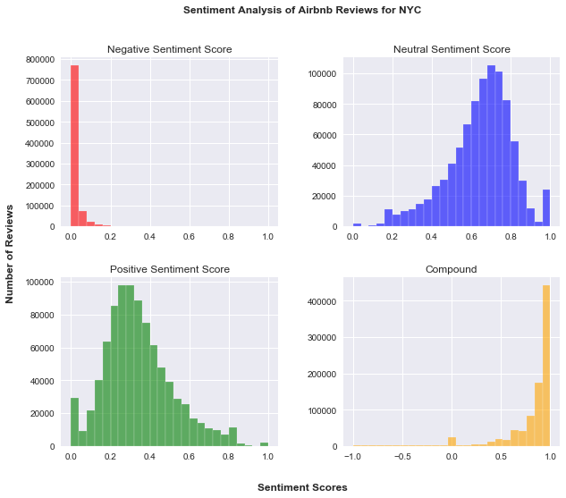
   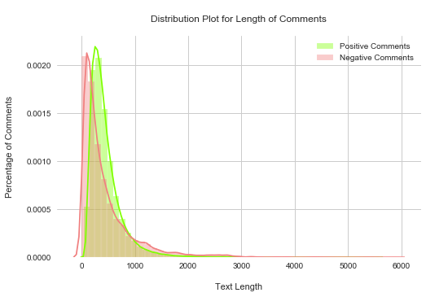
 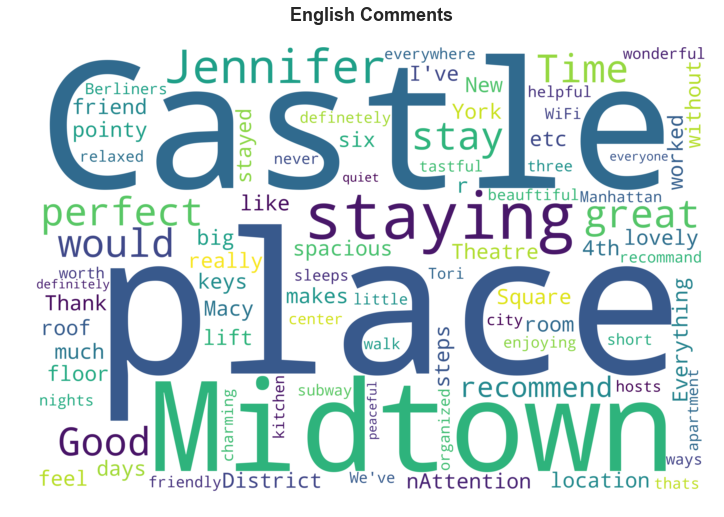

# [Heart Disease Prediction:](https://github.com/MunirYousef/Heart_Disease_Prediction/blob/main/Final_Project.Rmd)
This analysis was performed using the dataset available on Kaggle and the UCI Machine Learning Repository (https://archive.ics.uci.edu/ml/datasets/Heart+Disease).  
The goal of this project is to gain a better understanding of the causes of Heart Disease and/or heart failure; and use predictive modeling to find correlations and trends in the data that can be used towards early detection. The dataset contains 303 instances or “patients”, each with a set of values across 14 attributes. These attributes include age, sex, types of chest pain and others which can be used to predict cardiovascular events and overall heart health. All names and social security numbers included in the dataset have been switched with dummy values. After carrying out preprocessing operations I will explore the dataset to look for relationships and trends using supervised and unsupervised methods before creating a predictive model.  

Project tools used:
-	carey
-	tidyverse
-	e1071
-	NbClust
- ggplot

 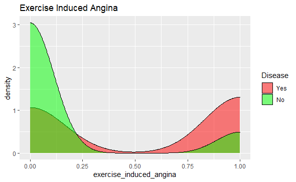
   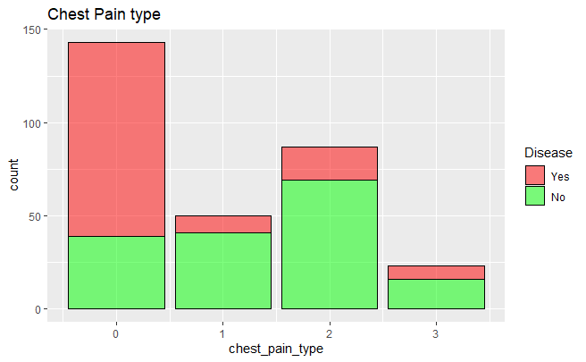
 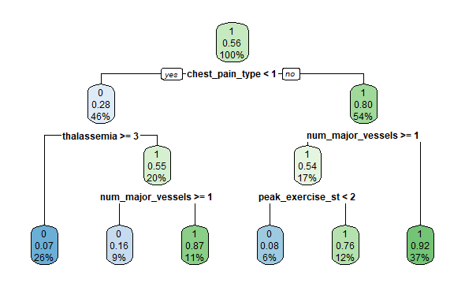

# [Breast Cancer Prediction:](https://github.com/MunirYousef/Breast_Cancer_Predictor/blob/gh-pages/Breast_Cancer_Predictor.ipynb)
The information presented in this file contains data representing the correlation between characteristics or features of cells in Malignant and Benign masses. Some of the features include "uniformity of cell shape" and "clump thickness". 
After plotting the data in pairplots and heatmaps to visualize our values, the data was then split into a training and testing group using sklearn and preprocessing methods. 
The data was then fit into various ML algorithms/classifiers to test the models accuracy. The results of each test were displayed in a confusion matrix and visualizers. 
######## These operations were performed using Python in Jupyter Notebook with the only requirement being the imported libraries and the breast cancer data set which is also available on kaggle.

Project tools used:
-	Numpy
-	Pandas
-	matplotlib.pyplot
-	seaborn

 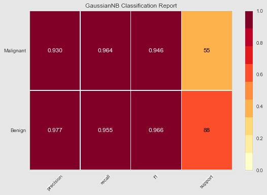
   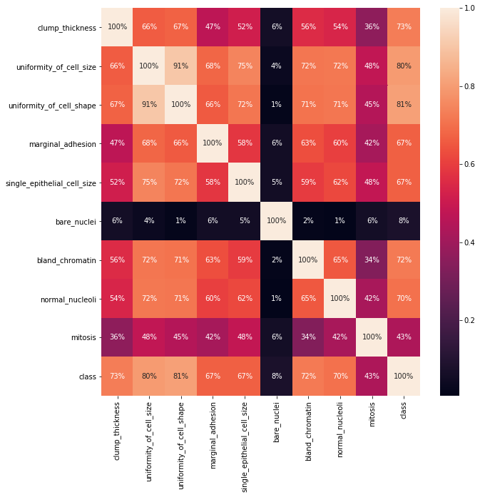

# [Global Temperature Prediction:](https://github.com/MunirYousef/Global_Temp/blob/master/Global_Temp_TS.ipynb)
This project was created to predict the trend of rising global temperatures using an ARIMA time series model. 
The procedure requires importing the necessesary tools for analysis and visualization. 
The dataset was pulled from https://datahub.io/core/global-temp and preprocessed to only include the temperatures recorded in March, every year from 1895 to 2016.

  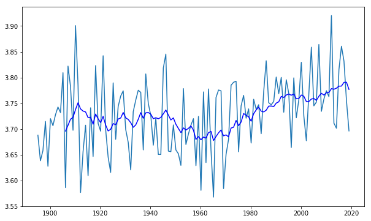
  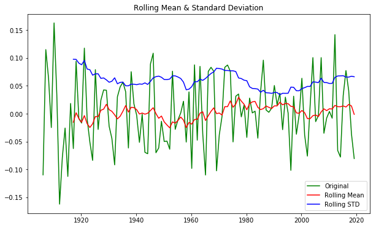
  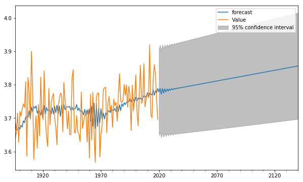

# [COVID-19 Data Visualization Microsoft Power BI:](https://github.com/MunirYousef/PowerBI/blob/master/Corona_World_Data.pbix)
Interactive data visualization of the demographics impacted by the global pandemic. The data visualized helps predict possible trends in transmission between nations.   

 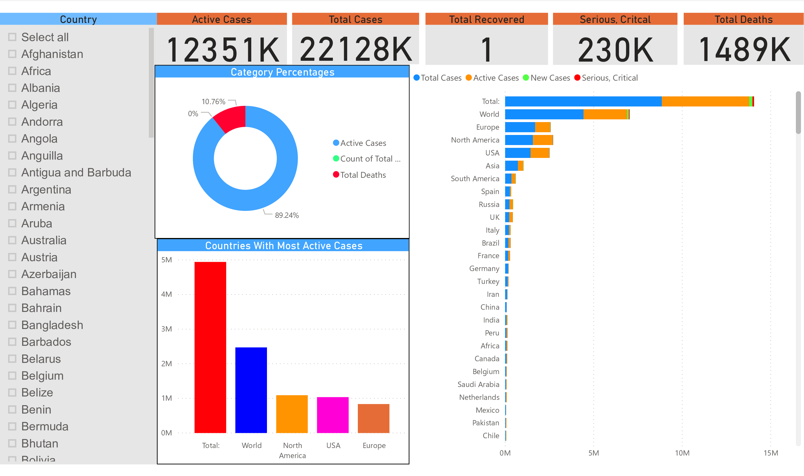
   

   
   

# [SSMS Database:](https://github.com/MunirYousef/GreyHat_SSMS/blob/main/sql_code.txt)
This file contains all the code to create a fully functional relational database in SQL Server Management Studio. The file contains dummy data that was used to present a business case for database optimization and functional efficiency. The code can be simply copied and pasted into SSMS and run to interact with a functional database. Tasks performed after database creation include creating and removing users and privileges, creating joins between tables, adding and removing rows of data and advanced querying. Code file also includes stored procedures and functions.     

 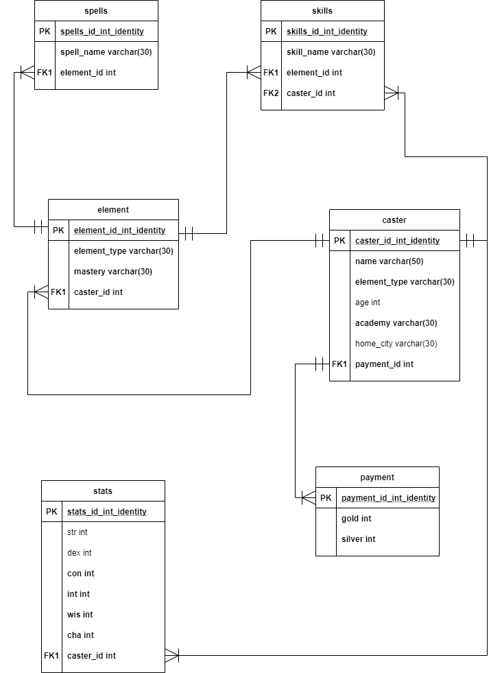
  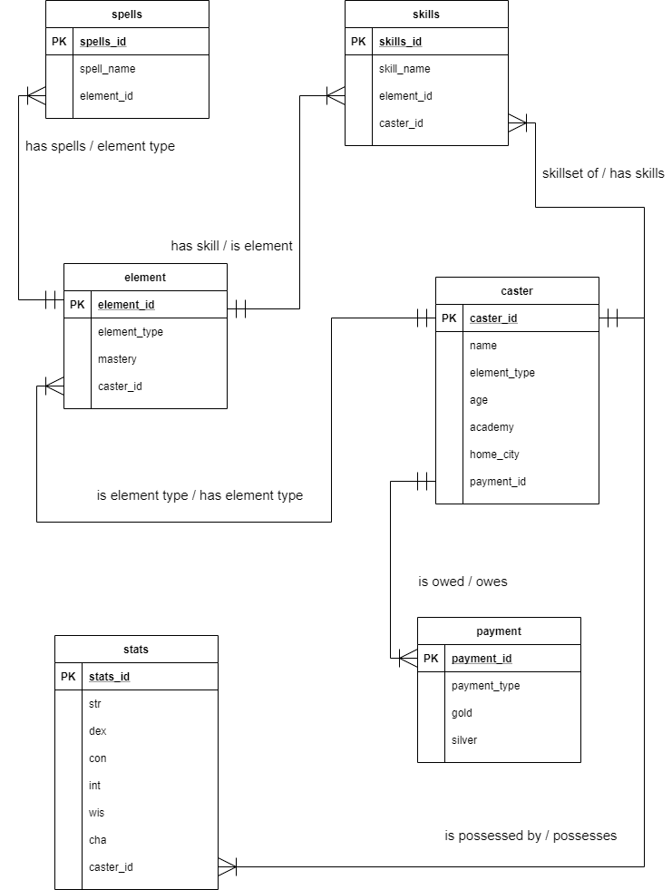

   

