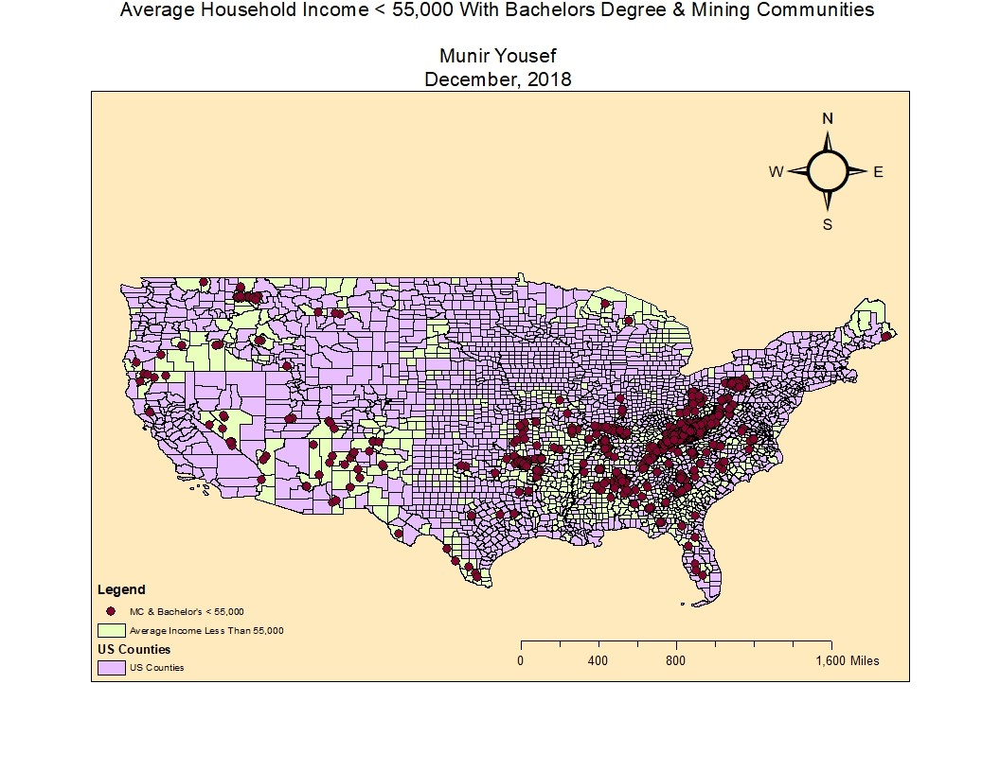
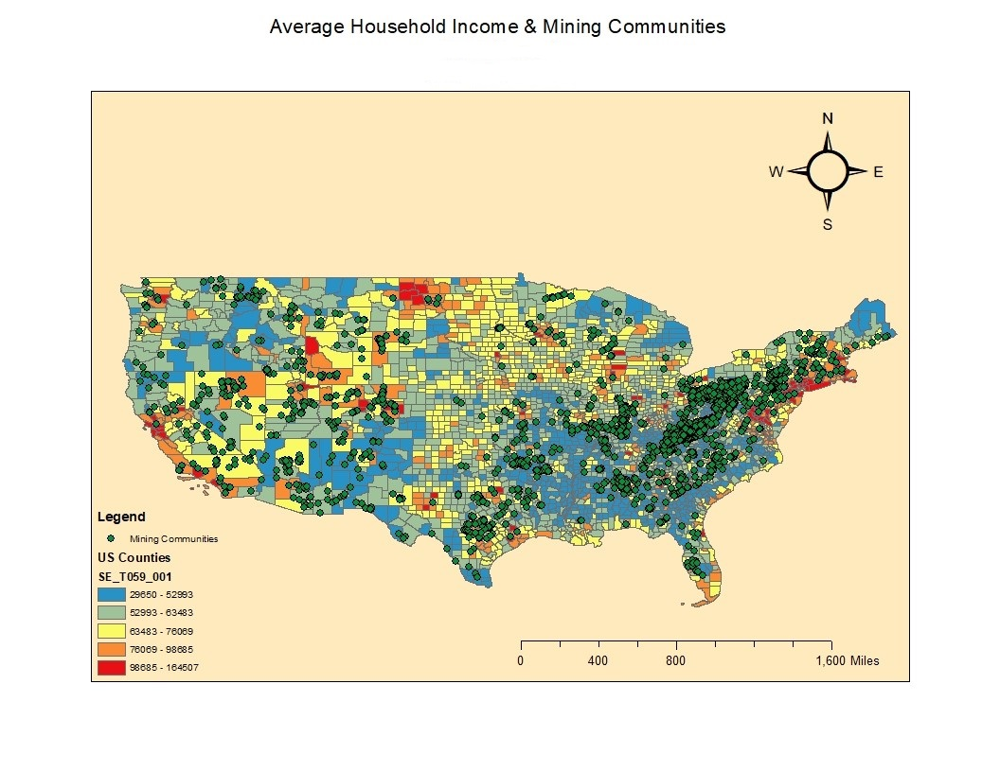

# Data Science Portfolio

# [COVID-19 Data Visualization:](https://public.tableau.com/profile/munir3451#!/vizhome/COVID-19_DATA/Dashboard1?publish=yes)
Interactive Tableau dashboard featuring current metrics and trends of the global COVID-19 pandemic. COVID-19 visualization featuring the pandemics global impact in real time. Data retrieved from the COVID-19 Global Data Tracker provides aggregate data compiled from state and local governments and health departments. 

 

# [Airbnb Sentiment Analysis:](https://github.com/MunirYousef/NLP_Airbnb/blob/main/NLP_Final_Project.ipynb)
This sentiment analysis was conducted on user reviews of left by Airbnb guests in NYC during 2015. After data collection and exploratory analysis, language detection was used to filter only the english comments. Data visualizations such as wordclouds, charts and frequency distributions showed what language characteristics were prevalent and before being sorted according to negative and positive polarity. Topic modeling and sentiment analysis were used to show what the most important factors of a guests stay were according to their experience. This data can be used to address issues that may impact the business negatively and enhance guest experience.    

Project tools used:
- NLTK
-	Numpy
-	Pandas
-	matplotlib.pyplot
-	seaborn

 
   
 

# [Breast Cancer Prediction:](https://github.com/MunirYousef/Breast_Cancer_Predictor/blob/gh-pages/Breast_Cancer_Predictor.ipynb)
The information presented in this file contains data representing the correlation between characteristics or features of cells in Malignant and Benign masses. Some of the features include "uniformity of cell shape" and "clump thickness". 
After plotting the data in pairplots and heatmaps to visualize our values, the data was then split into a training and testing group using sklearn and preprocessing methods. 
The data was then fit into various ML algorithms/classifiers to test the models accuracy. The results of each test were displayed in a confusion matrix and visualizers. 
######## These operations were performed using Python in Jupyter Notebook with the only requirement being the imported libraries and the breast cancer data set which is also available on kaggle.

Project tools used:
-	Numpy
-	Pandas
-	matplotlib.pyplot
-	seaborn

 
   

# [Global Temperature Prediction:](https://github.com/MunirYousef/Global_Temp/blob/master/Global_Temp_TS.ipynb)
This project was created to predict the trend of rising global temperatures using an ARIMA time series model. 
The procedure requires importing the necessesary tools for analysis and visualization. 
The dataset was pulled from https://datahub.io/core/global-temp and preprocessed to only include the temperatures recorded in March, every year from 1895 to 2016.

  
  
  

# [COVID-19 Data Visualization Microsoft Power BI:](https://github.com/MunirYousef/PowerBI/blob/master/Corona_World_Data.pbix)
Interactive data visualization of the demographics impacted by the global pandemic. The data visualized helps predict possible trends in transmission between nations.   

 
   

# [ArcGIS Analysis Of Mining Communities In The United States:](https://github.com/MunirYousef/ArcGIS/blob/master/yousef-%20ArcGIS%20Final%20Part3.docx)

In most cases, mining camps came first and communities built up around them. These communities have a number of different aspects that can be analyzed along demographic lines to better understand how earning potential in households are impacted by the presence of mining operations. This too can take many forms including educational achievement, etc.  While all of these are important to analyze together, this study focused average household income in mining communities by County.  

**Methodology**
The development environment for this study was ESRI ArcGIS Arcmap.
This study used data from Social Explorer’s Education data set. Social Explorer has a wide variety of demographic data sets including:
1.	Education
2.	Employment
3.	Family
4.	Housing
5.	Income
6.	Poverty
7.	Real Estate

